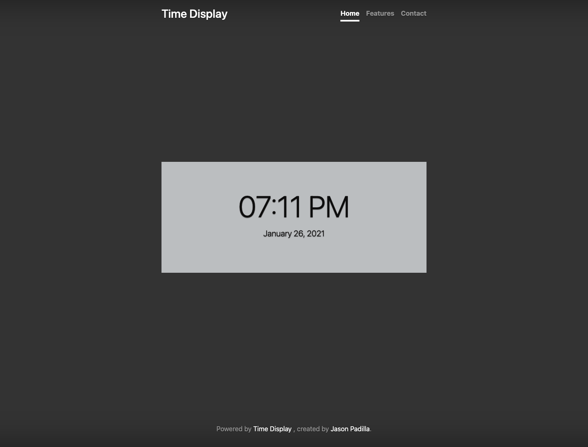

# :computer: TimeDisplay
This is the first Django project that I have created, it is a simple page that shows the user the current date and time.

# :pencil2: What I learned  
  * Django structure
  * Timezone management

# :camera: Screenshots

